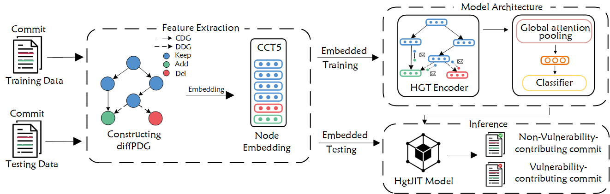

# HgtJIT: Just-In-Time Vulnerability Detection with Heterogeneous Graph Transformer

## Abstract
Vulnerability detection plays a crucial role in the software development lifecycle. Commit-level vulnerability detection aims to detect whether the changed code contributes to potential vulnerabilities at the time of the commit, which is also referred to as Just-In-Time (JIT) vulnerability detection. Previous JIT vulnerability detection approaches relied on code metrics and textual features, which were unable to effectively characterize vulnerability-contributing commits. Recently, CodeJIT, a code-centric learning-based approach, has been proposed to detect vulnerabilities at the commit level. However, CodeJIT still has its limitations: crucial graph information is overlooked, the feature representation of code changes is inadequate, and there is insufficient utilization of heterogeneous information.

In this paper, we propose HgtJIT, a JIT vulnerability detection approach based on a Heterogeneous Graph Transformer (HGT) to address several limitations of the state-of-the-art CodeJIT approach. We propose diffPDG to represent code changes and use the CCT5 model (the latest feature encoder pre-trained on a large-scale code change corpus) to embed graph nodes to generate the most meaningful vector representations. In addition, we employ HGT to adequately utilize the heterogeneous information of the graph to learn vulnerability features. Extensive experiments have shown that HgtJIT is the best-performing model, with F1 improvement of 3.3% to 12.2% compared to the baseline model.

## Overview


## Data Preprocessing
Run the following commands to process your commit data:
```sh
python preprocess/get_ab_file.py
python preprocess/gen_cpg.py
python preprocess/merge_pdg.py
```

## Model Training and Testing
Run test_hgt_cct5.py to train and test your dataset:
```sh
python test_hgt_cct5.py
```
